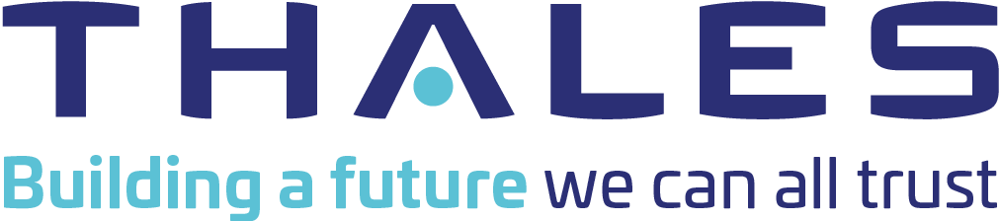

<h1>Thales CERT training</h1>

<h2>Welcome to this homemade Windows based DFIR repository</h2>
 
 
<h4>This repository is composed with two main external components:</h4>
<ul>
	<li><b><u>Flare-VM developped by FireEye</u>:</b>
		A fully customizable, Windows-based security distribution for malware analysis, incident response, penetration testing, etc.
		Most of the tools are available from the Windows Desktop, under "Flare-VM" folder.
		<a href="https://github.com/fireeye/flre-vm" target="_blank>https://github.com/fireeye/flre-vm</a>
	</li>
	<li><b><u>IntroLabs developped by BlackHills InfoSec</u>:</b>
	A set of tools used for DFIR investigations: forensics, network analysis, binary assessment, etc.
	To run the tools, we invite you to use the menu on top of this page.
	<a href="https://github.com/strandjs/IntroLabs" target="_blank>https://github.com/strandjs/IntroLabs</a>
	</li>
</ul>

<h4>Links and Support:</h4>
<ul>
	<li><b><u>Thales CERT - T-Wiki space</u>:</b> https://wiki.corp.thales/x/NwcdMg</li>
	<li><b><u>Thales CERT - Public page</u>:</b> https://www.thalesgroup.com/en/cert</li>
	<li><b><u>Thales CERT - GitHub page</u>:</b> https://github.com/thalesgroup-cert</li>
	<li><b><u>Thales CERT - VM Project</u>:</b> https://github.com/thalesgroup-cert/Forensics-VMs</li>
	 
	<li><b><u>Thales PSIRT - T-Wiki space</u>:</b> https://wiki.corp.thales/display/tcp/Thales+PSIRT</li>
	<li><b><u>Thales PSIRT - Public page</u>:</b> https://www.thalesgroup.com/en/global/group/psirt</li>
	 
	<li><b><u>CERT TheHive</u>:</b> https://cert-thehive.corp.thales</li>
	<li><b><u>CERT MISP</u>:</b> https://cert-misp.corp.thales</li>
	<li><b><u>CERT Watcher</u>:</b> https://cert-watcher.corp.thales</li>
	<li><b><u>CyberPortal</u>:</b> https://cyberportal.corp.thales</li>
</ul>

<!--  -->